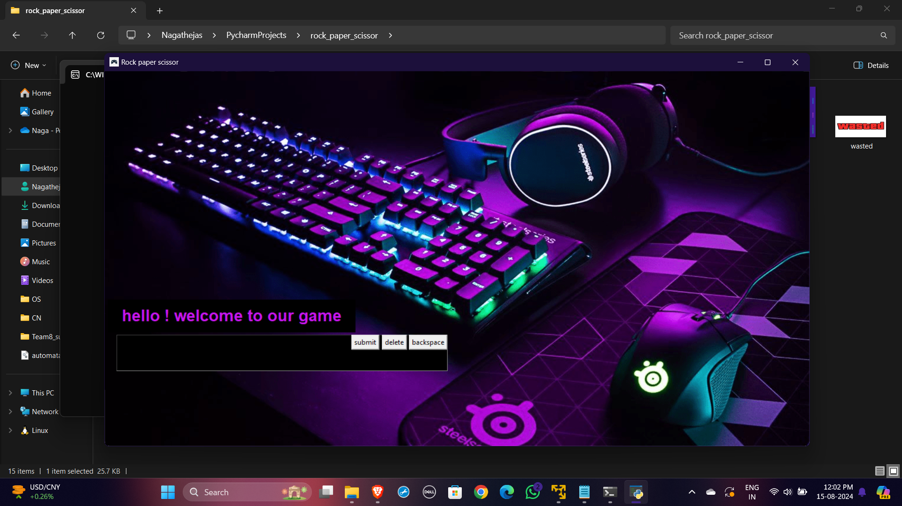
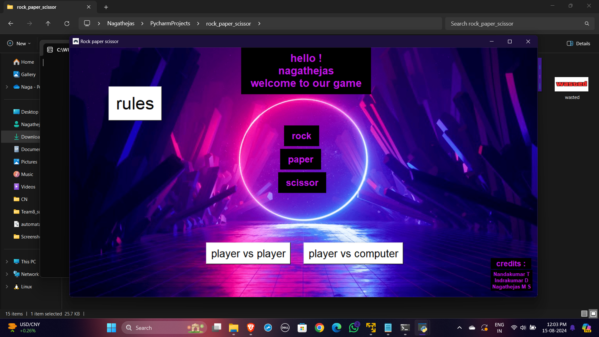
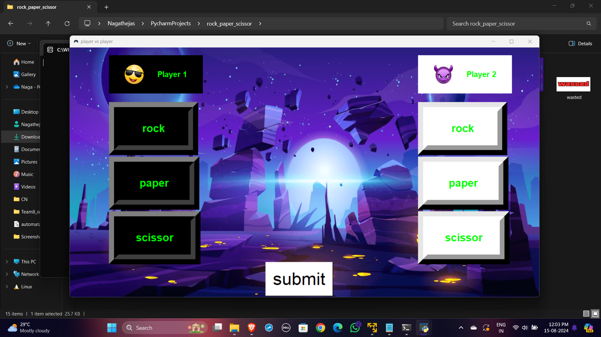
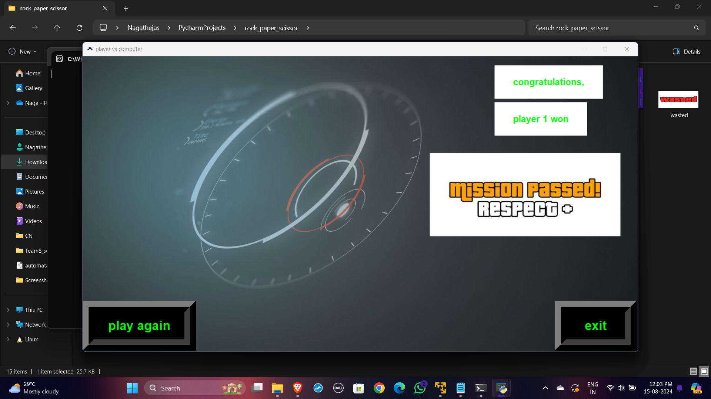

# Rock-Paper-Scissors-Arena-with-GUI-in-Python

Welcome to **Rock-Paper-Scissors-Arena**, a fun and interactive Tkinter-based game where you can challenge your friends or test your skills against a computer opponent. 

## Features

- **Player vs Player Mode:** Compete with a friend in a classic rock-paper-scissors showdown.
- **Player vs Computer Mode:** Test your luck against a randomly selecting computer opponent.
- **Game Rules:** View the rules of the game through a dedicated rules screen.
- **Results Screen:** See the outcome of each game with a detailed results display.
- **User Interface:** Customizable and attractive UI elements to enhance gameplay experience.

## Screenshots


*Game Intro Screen*


*Main Screen*


*Player vs Player Mode*


*Results*

## Installation

1. Clone the repository:
   ```bash
   git clone https://github.com/Nagathejas-M-S/Rock-Paper-Scissors-Arena-with-GUI-in-Python.git
  
2.Ensure you have Python and Tkinter installed. Tkinter is included with most Python installations.

Run the application:  
 ```bash
python rock_paper_scissor.py
```

## Usage 

Start the Game: Upon launching, enter your name and click "Submit" to proceed to the main game menu.
Select Game Mode: Choose between "Player vs Player" or "Player vs Computer" to start a game.
Play the Game: Click the appropriate buttons to select your move (rock, paper, or scissors).
View Results: Check the results after each game and decide if you want to play again or exit.

## Credits
Developed by: Nandakumar T, Indrakumar D, Nagathejas M S
